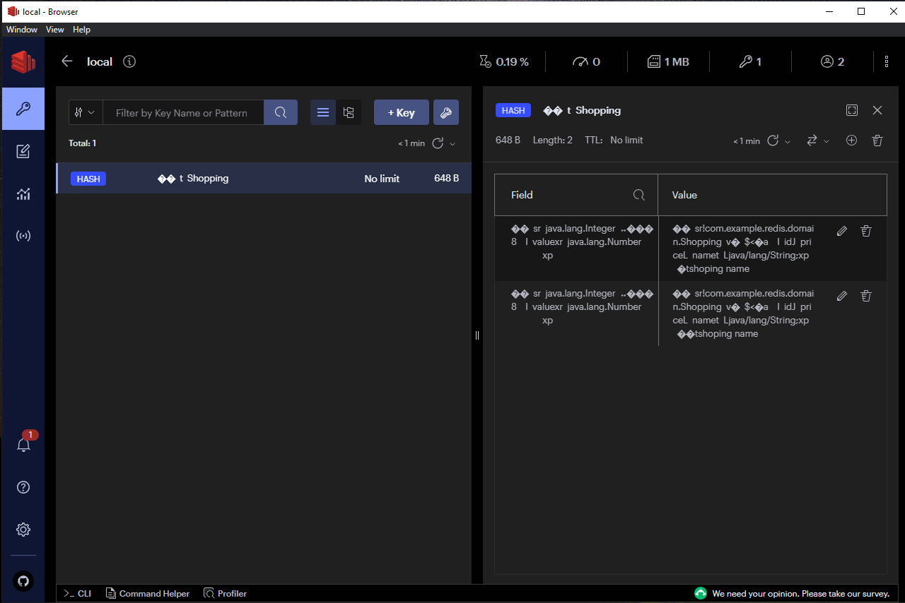

# Need: docker for windows

step 1: open cmd

docker-compose -f docker-compose.yml up -d

step 2: run postman

    ============================= WAY 1:=============================
    POST http://localhost:8080/create
    {
    "id": 1,
    "name": "shoping name 5",
    "price": 500
    }

    GET http://localhost:8080/get?id=1

    GET http://localhost:8080/check?id=1

    ============================= WAY 2:=============================
    POST http://localhost:8080/add
    {
        "id": 1,
        "name": "shoping name",
        "price": 100
    }

    GET http://localhost:8080/getAll

RedisInsight-v2

